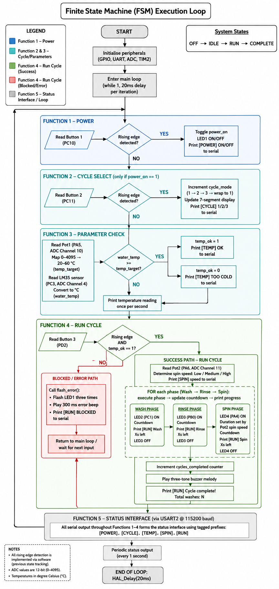

# STM32 Washing Machine Control Panel

Embedded system project using the STM32L476RG Nucleo-64 microcontroller.

---

## 📌 Project Overview

This system simulates a washing machine control panel with:

- Power control  
- Cycle selection (Quick / Normal / Heavy)  
- Temperature-based safety check  
- Sequential execution of wash phases  
- Real-time serial monitoring  

The user interacts using buttons and a potentiometer, while system state is displayed through LEDs and a 7-segment display.

---

## 🖼️ System Overview

---

## ⚙️ System Design

The system follows a **finite state machine approach** inside a continuous loop:

- Inputs are read continuously (buttons, ADC)
- System state is evaluated
- Outputs update accordingly (LEDs, serial, buzzer)

### Key Design Aspects:
- Edge-detected button input  
- ADC-based sensing (LM35 + potentiometer)  
- Sequential phase execution  
- UART-based status output  

---

## 🧠 Design Flow

---

## 🔧 Hardware Mapping

| Component | Pin |
|----------|-----|
| Power LED | PA4 |
| Wash LED | PB0 |
| Rinse LED | PC1 |
| Spin LED (Red) | PC0 |
| Button 1 (Power) | PC10 |
| Button 2 (Cycle) | PC11 |
| Button 3 (Run) | PD2 |
| LM35 Sensor | PC3 |
| Potentiometer | PA5 |

---

## 📁 Project Structure

The main logic is implemented in: Core/Src/main.c

---

## ⚙️ Setup & Build Instructions

1. Open the project folder containing:

Core
Drivers
CMakeLists.txt

2. When prompted:
> "Would you like to configure discovered CMake project as STM32Cube project?"

👉 Select **Yes**

3. Choose **Debug configuration**

4. Click **Build** to verify compilation

5. Check that the board is detected under:

STM32CUBE Devices and Boards

6. Click **Run and Debug**

7. Select:

STM32Cube: STLink GDB Server

8. Press:

F5
to run the program

---

## 🚀 Features

- Power toggle with LED indicator  
- Cycle selection using 7-segment display  
- Temperature threshold check  
- Wash → Rinse → Spin sequence  
- Serial output with system status  
- Buzzer feedback on completion  
- Error handling with LED flashing  

---

## ⚠️ Troubleshooting

### Board not detected
- Ensure ST-Link drivers are installed  
- Use the correct USB port (**USB ST-LINK**)  
- Try a different cable or port  
- Check device under STM32Cube run panel  

---

### Build errors
- Ensure project was configured as STM32Cube project  
- Clean and rebuild the project  
- Confirm Debug configuration is selected  

---

## ⚡ Stack

- C (STM32 HAL)  
- GPIO / ADC / UART  
- Embedded system design  
